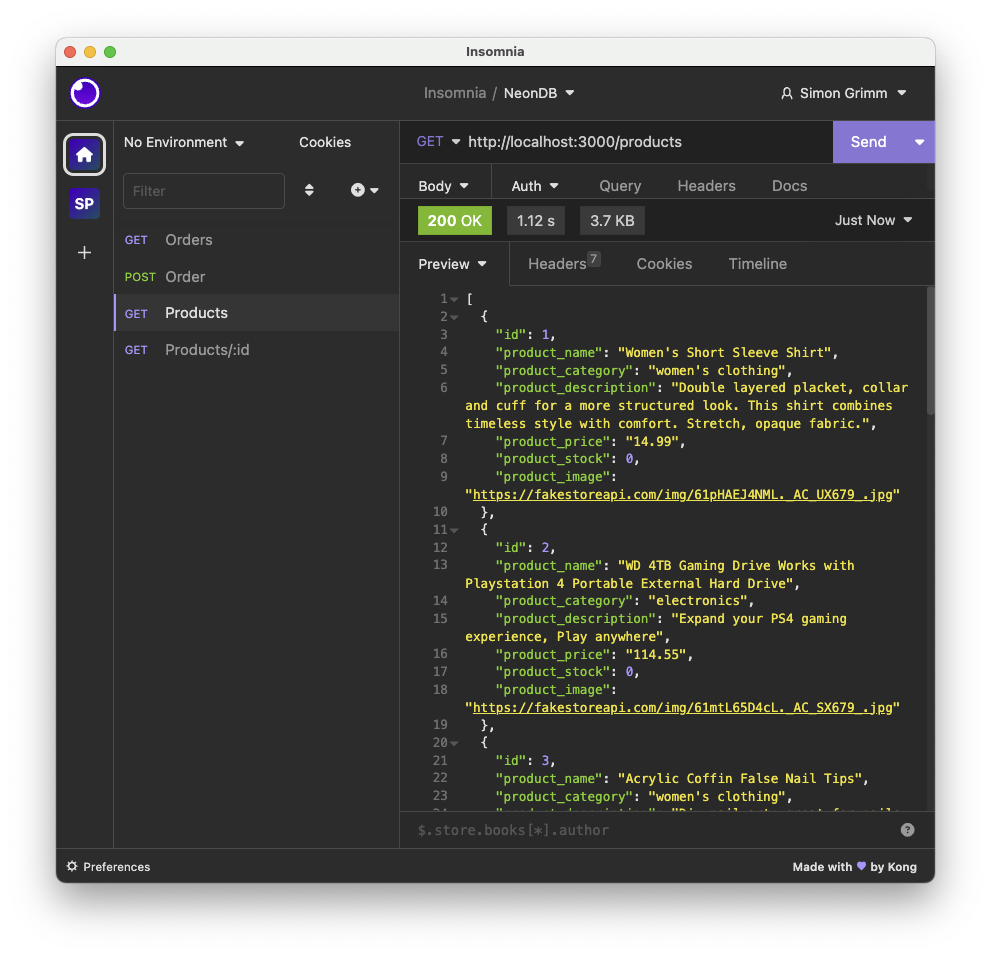
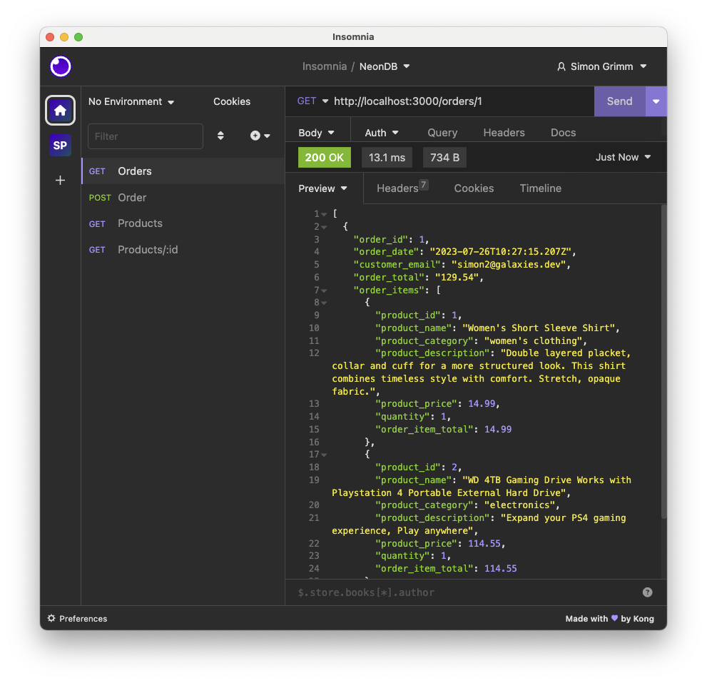

# React Native E-Commerce App with API and Neon Database

This is a simpler React Native E-Commerce App with Expo App and Express server using a [Neon database](https://neon.tech/).

To run the project, check out the [myShop-app](./myShop-app) and [myShop-server](./express-server) directories.

## App Screenshots

## API Screenshots

