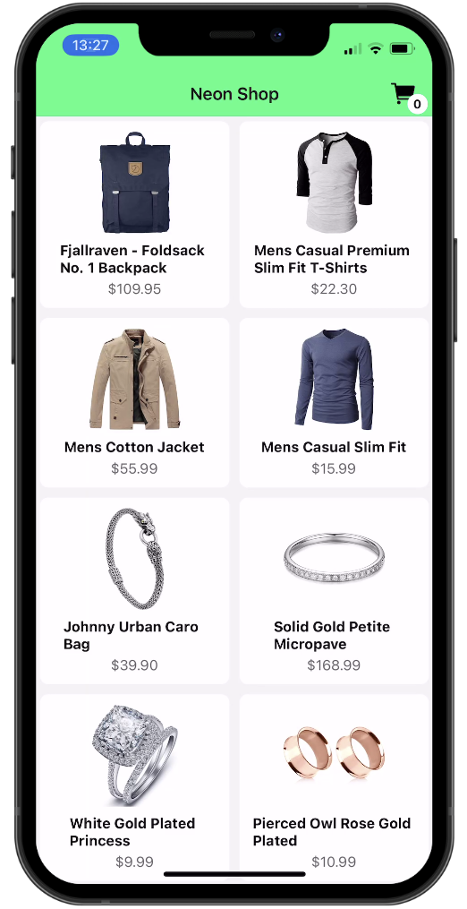
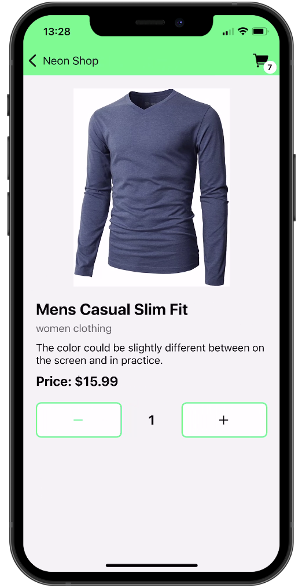
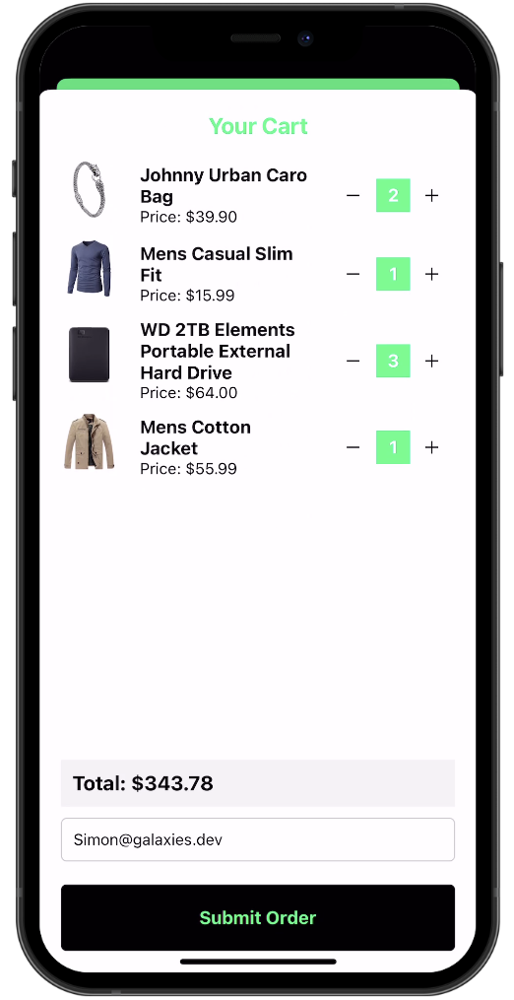
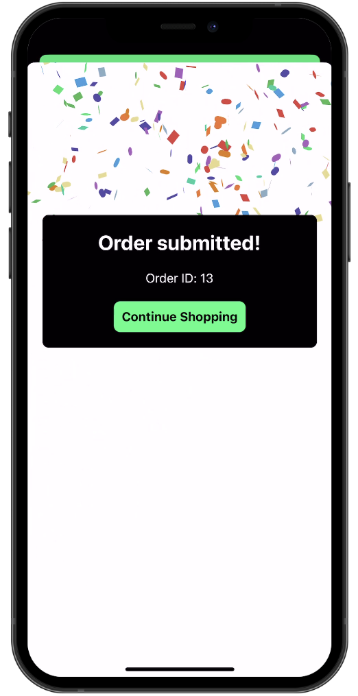

# React Native Shopping App

This is a simple shopping app built with React Native and Expo using a Node.js backend with [Neon database](https://neon.tech/).

To get started, clone the repo and run `npm install` in the root directory. Then run `expo start` to start the app.

Make sure to run the backend server as well!
## Preview

